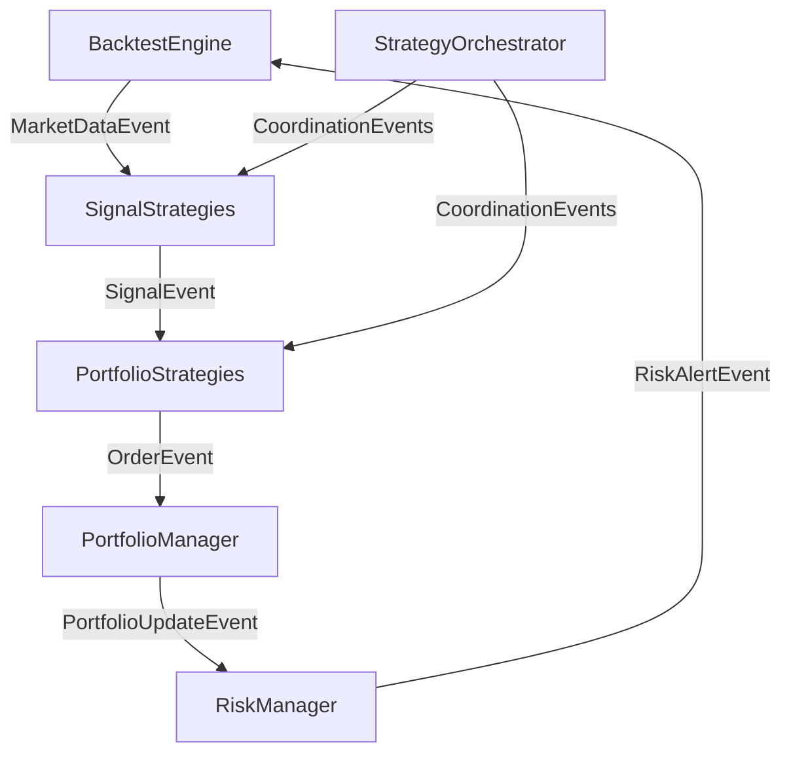

# BACKTESTER UPDATE: Enhanced Strategy System with Event-Driven Architecture

## Overview

This document outlines a comprehensive plan to implement an enhanced strategy system for the backtesting framework, featuring event-driven architecture, dependency inversion, and modular strategy components. The implementation will enable easy integration with the existing BacktestEngine while providing flexible, extensible strategy management.

## Current Architecture Analysis

### Existing Components
- **Core Engine**: [`BacktestEngine`](backtester/core/backtest_engine.py:29) - Main orchestrator
- **Configuration**: Pydantic-based config system with [`ComprehensiveRiskConfig`](backtester/risk_management/component_configs/comprehensive_risk_config.py:18)
- **Strategy Base**: [`BaseStrategy`](backtester/strategy/base.py:16) - Abstract base for strategies
- **Signal System**: [`SignalGenerator`](backtester/signal/signal_types.py:19) - Standardized signal creation
- **Model System**: [`BaseModel`](backtester/model/base_model.py:87) - ML model integration
- **Risk Management**: Comprehensive risk control with component configs

### Current Limitations
1. **Tight Coupling**: Strategies directly interact with BacktestEngine
2. **Limited Event Handling**: No event-driven communication between components
3. **Strategy Monolith**: Single strategy instance per backtest
4. **No Orchestration**: Limited ability to combine multiple strategies
5. **Signal Processing**: Basic signal generation without advanced routing

## Proposed Architecture

### 1. Event Bus System

#### Core Components
```python
# backtester/core/event_bus.py
class EventBus:
    """Central event bus for decoupled component communication."""
    
class Event:
    """Base event class for all system events."""
    
class EventHandler(ABC):
    """Abstract base class for event handlers."""
```

#### Event Types
- **MarketDataEvent**: New market data available
- **SignalEvent**: Trading signal generated
- **OrderEvent**: Order execution request
- **PortfolioUpdateEvent**: Portfolio state changed
- **RiskAlertEvent**: Risk threshold breached
- **StrategyEvent**: Strategy-specific events

#### Integration Points
- BacktestEngine publishes market data events
- Strategies subscribe to market data and publish signals
- Risk management subscribes to portfolio and signal events
- Portfolio management subscribes to order events

### 2. Enhanced Strategy System

#### A. Signal Strategy Layer

**Base Classes:**
```python
# backtester/strategy/signal/base_signal_strategy.py
class BaseSignalStrategy(ABC):
    """Abstract base for signal generation strategies."""
    
    def __init__(self, config: SignalStrategyConfig, event_bus: EventBus):
        self.config = config
        self.event_bus = event_bus
        self.logger = get_backtester_logger(__name__)
```

**Concrete Implementations:**
1. **TechnicalAnalysisStrategy**: Technical indicator-based signals
2. **MLModelStrategy**: Machine learning model-based signals  
3. **ArbitrageStrategy**: Statistical arbitrage signals
4. **MomentumStrategy**: Momentum-based signals
5. **MeanReversionStrategy**: Mean reversion signals

**Configuration:**
```python
# backtester/strategy/signal/signal_strategy_config.py
class SignalStrategyConfig(BaseModel):
    strategy_type: SignalStrategyType
    indicators: list[IndicatorConfig]
    models: list[ModelConfig]
    signal_filters: list[SignalFilterConfig]
    risk_parameters: RiskParameters
    execution_params: ExecutionParameters
```

#### B. Portfolio Strategy Layer

**Base Classes:**
```python
# backtester/strategy/portfolio/base_portfolio_strategy.py
class BasePortfolioStrategy(ABC):
    """Abstract base for portfolio allocation strategies."""
    
    def __init__(self, config: PortfolioStrategyConfig, event_bus: EventBus):
        self.config = config
        self.event_bus = event_bus
        self.logger = get_backtester_logger(__name__)
```

**Concrete Implementations:**
1. **EqualWeightStrategy**: Equal weight allocation
2. **RiskParityStrategy**: Risk parity allocation
3. **KellyCriterionStrategy**: Kelly criterion sizing
4. **ModernPortfolioTheoryStrategy**: MPT-based allocation
5. **ConcentratedStrategy**: Concentrated portfolio strategy

**Configuration:**
```python
# backtester/strategy/portfolio/portfolio_strategy_config.py
class PortfolioStrategyConfig(BaseModel):
    strategy_type: PortfolioStrategyType
    allocation_method: AllocationMethod
    rebalance_frequency: str
    risk_budget: dict[str, float]
    constraints: PortfolioConstraints
    optimization_params: OptimizationParameters
```

#### C. Strategy Orchestration Layer

**Base Classes:**
```python
# backtester/strategy/orchestration/base_orchestration.py
class BaseStrategyOrchestrator(ABC):
    """Abstract base for strategy orchestration."""
    
    def __init__(self, config: OrchestrationConfig, event_bus: EventBus):
        self.config = config
        self.event_bus = event_bus
        self.strategies: dict[str, BaseStrategy] = {}
        self.logger = get_backtester_logger(__name__)
```

**Concrete Implementations:**
1. **SequentialOrchestrator**: Run strategies sequentially
2. **ParallelOrchestrator**: Run strategies in parallel
3. **MasterSlaveOrchestrator**: Master strategy controls slave strategies
4. **EnsembleOrchestrator**: Combine multiple strategies
5. **ConditionalOrchestrator**: Conditional strategy execution

**Configuration:**
```python
# backtester/strategy/orchestration/orchestration_strategy_config.py
class OrchestrationConfig(BaseModel):
    orchestrator_type: OrchestratorType
    strategies: list[StrategyReference]
    coordination_rules: list[CoordinationRule]
    conflict_resolution: ConflictResolutionStrategy
    performance_aggregation: PerformanceAggregationMethod
```

### 3. Integration Architecture

#### Dependency Inversion Pattern
```python
# Components depend on abstractions, not concrete implementations
class BacktestEngine:
    def __init__(self, event_bus: EventBus, strategy_orchestrator: BaseStrategyOrchestrator):
        self.event_bus = event_bus
        self.strategy_orchestrator = strategy_orchestrator
```

#### Event Flow Diagram


### 4. Implementation Roadmap

#### Phase 1: Core Infrastructure (Week 1-2)
1. **Event Bus Implementation**
   - Create `EventBus` class with publish/subscribe pattern
   - Implement core event types and handlers
   - Add event filtering and routing capabilities

2. **Configuration System Extension**
   - Create new config classes for strategy system
   - Extend existing config validation
   - Add config inheritance and composition

#### Phase 2: Strategy Layer Implementation (Week 3-4)
1. **Signal Strategy Layer**
   - Implement `BaseSignalStrategy` and core strategies
   - Create signal strategy configurations
   - Add indicator and model integration

2. **Portfolio Strategy Layer**
   - Implement `BasePortfolioStrategy` and core strategies
   - Create portfolio strategy configurations
   - Add optimization and constraint handling

#### Phase 3: Orchestration Layer (Week 5-6)
1. **Strategy Orchestrator**
   - Implement `BaseStrategyOrchestrator` and orchestrators
   - Create orchestration configurations
   - Add coordination and conflict resolution

2. **Integration Components**
   - Create strategy factories
   - Add strategy lifecycle management
   - Implement performance aggregation

#### Phase 4: BacktestEngine Integration (Week 7-8)
1. **Engine Refactoring**
   - Integrate event bus into BacktestEngine
   - Add strategy orchestrator support
   - Implement event-driven workflow

2. **Testing and Validation**
   - Create comprehensive test suite
   - Performance benchmarking
   - Integration testing with existing components

### 5. File Structure

```
backtester/
├── core/
│   ├── event_bus.py                 # New: Central event system
│   ├── events.py                    # New: Event definitions
│   └── event_handlers.py            # New: Event handler implementations
├── strategy/
│   ├── signal/
│   │   ├── __init__.py
│   │   ├── base_signal_strategy.py  # New: Base signal strategy
│   │   ├── technical_analysis_strategy.py  # New: TA-based signals
│   │   ├── ml_model_strategy.py     # New: ML-based signals
│   │   ├── momentum_strategy.py     # New: Momentum signals
│   │   ├── mean_reversion_strategy.py  # New: Mean reversion signals
│   │   └── signal_strategy_config.py  # New: Signal strategy config
│   ├── portfolio/
│   │   ├── __init__.py
│   │   ├── base_portfolio_strategy.py  # New: Base portfolio strategy
│   │   ├── equal_weight_strategy.py  # New: Equal weight allocation
│   │   ├── risk_parity_strategy.py   # New: Risk parity allocation
│   │   ├── kelly_strategy.py        # New: Kelly criterion
│   │   └── portfolio_strategy_config.py  # New: Portfolio strategy config
│   ├── orchestration/
│   │   ├── __init__.py
│   │   ├── base_orchestration.py    # New: Base strategy orchestrator
│   │   ├── sequential_orchestrator.py  # New: Sequential execution
│   │   ├── parallel_orchestrator.py    # New: Parallel execution
│   │   ├── ensemble_orchestrator.py    # New: Ensemble combination
│   │   └── orchestration_strategy_config.py  # New: Orchestration config
│   └── __init__.py
├── config/
│   ├── strategy_configs.py          # New: Extended strategy configuration
│   └── __init__.py
└── utils/
    ├── strategy_utils.py            # New: Strategy utilities
    └── __init__.py
```

### 6. Key Design Principles

#### 1. Event-Driven Architecture
- **Decoupling**: Components communicate via events, not direct calls
- **Scalability**: Easy to add new event types and handlers
- **Testability**: Components can be tested in isolation

#### 2. Dependency Inversion
- **Abstractions**: Components depend on interfaces, not implementations
- **Flexibility**: Easy to swap implementations
- **Extensibility**: New strategies can be added without modifying existing code

#### 3. Configuration-Driven
- **Consistency**: All strategies use统一的配置格式
- **Validation**: Pydantic-based configuration validation
- **Composition**: Strategies can be composed and configured

#### 4. Modular Design
- **Single Responsibility**: Each component has one clear purpose
- **Separation of Concerns**: Signal generation, portfolio allocation, and orchestration are separate
- **Reusability**: Components can be reused across different strategies

### 7. Integration with Existing System

#### BacktestEngine Modifications
```python
class BacktestEngine:
    def __init__(self, 
                 config: BacktesterConfig | None = None,
                 logger: logging.Logger | None = None,
                 event_bus: EventBus | None = None,
                 strategy_orchestrator: BaseStrategyOrchestrator | None = None):
        # Existing initialization...
        self.event_bus = event_bus or EventBus()
        self.strategy_orchestrator = strategy_orchestrator
        
    def run_backtest(self, ...):
        # Existing setup...
        
        # Event-driven workflow
        self._run_event_driven_simulation()
        
    def _run_event_driven_simulation(self):
        for timestamp, row in self.current_data.iterrows():
            # Publish market data event
            event = MarketDataEvent(timestamp, row)
            self.event_bus.publish(event)
            
            # Process events through orchestrator
            self.strategy_orchestrator.process_events(timestamp)
```

#### Compatibility Layer
- Maintain existing API for backward compatibility
- Add new event-driven API alongside existing methods
- Gradual migration path for existing users

### 8. Performance Considerations

#### Event Processing Optimization
- **Event Batching**: Batch similar events for processing
- **Asynchronous Processing**: Use async/await for non-blocking operations
- **Event Filtering**: Filter events at source to reduce processing load

#### Strategy Performance
- **Caching**: Cache expensive calculations
- **Parallel Processing**: Parallel independent strategy calculations
- **Lazy Evaluation**: Only calculate what's needed for current state

### 9. Testing Strategy

#### Unit Testing
- Event bus functionality
- Individual strategy components
- Configuration validation
- Event handler implementations

#### Integration Testing
- Strategy integration with event bus
- End-to-end event flow
- BacktestEngine integration
- Cross-component communication

#### Performance Testing
- Event processing throughput
- Strategy execution time
- Memory usage patterns
- Scalability with multiple strategies

### 10. Migration Path

#### Phase 1: Parallel Implementation
- Implement new system alongside existing code
- Ensure feature parity
- Gradual migration of test cases

#### Phase 2: Selective Migration
- Migrate specific strategies to new system
- Gather performance and usability feedback
- Refine based on real-world usage

#### Phase 3: Full Migration
- Migrate all strategies to new system
- Deprecate old API
- Update documentation and examples

### 11. Future Enhancements

#### Advanced Features
- **Machine Learning Integration**: Enhanced ML model integration
- **Multi-Asset Support**: Cross-asset strategy coordination
- **Real-Time Processing**: Real-time backtesting capabilities
- **Cloud Integration**: Cloud-based strategy execution

#### Community Extensions
- **Strategy Marketplace**: Community-contributed strategies
- **Plugin System**: Extensible plugin architecture
- **Visualization Tools**: Advanced strategy visualization
- **Performance Analytics**: Detailed strategy analytics

## Conclusion

This enhanced strategy system will provide a robust, event-driven architecture that enables flexible, decoupled strategy development while maintaining compatibility with the existing backtesting framework. The implementation follows established design patterns and provides a clear migration path for existing users.

The new system will enable:
- **Event-driven communication** between all components
- **Modular strategy development** with clear separation of concerns
- **Flexible strategy orchestration** with multiple coordination patterns
- **Easy integration** with existing BacktestEngine
- **Extensible architecture** for future enhancements

This represents a significant evolution of the backtesting framework, providing a solid foundation for advanced quantitative trading strategies.